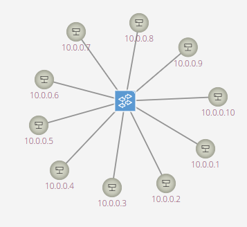
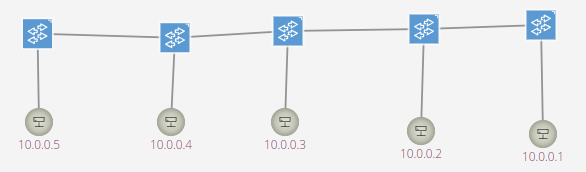
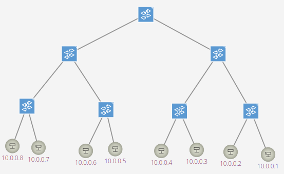

# Solutions to tasks of Demo1

## Task 1

#### Create using the CLI interface and the OpenFlow Reference Controller

##### 1. A single-switch topology with 10 hosts. Note that a “single-switch topology” means one switch connected to all hosts. 
* command used: 
    ```bash
    $ sudo mn --topo single,10
    ```

* output:
    ```bash
    *** No default OpenFlow controller found for default switch!
    *** Falling back to OVS Bridge
    *** Creating network
    *** Adding controller
    *** Adding hosts:
    h1 h2 h3 h4 h5 h6 h7 h8 h9 h10 
    *** Adding switches:
    s1 
    *** Adding links:
    (h1, s1) (h2, s1) (h3, s1) (h4, s1) (h5, s1) (h6, s1) (h7, s1) (h8, s1) (h9, s1) (h10, s1) 
    *** Configuring hosts
    h1 h2 h3 h4 h5 h6 h7 h8 h9 h10 
    *** Starting controller

    *** Starting 1 switches
    s1 ...
    *** Starting CLI:
    mininet> net
    h1 h1-eth0:s1-eth1
    h2 h2-eth0:s1-eth2
    h3 h3-eth0:s1-eth3
    h4 h4-eth0:s1-eth4
    h5 h5-eth0:s1-eth5
    h6 h6-eth0:s1-eth6
    h7 h7-eth0:s1-eth7
    h8 h8-eth0:s1-eth8
    h9 h9-eth0:s1-eth9
    h10 h10-eth0:s1-eth10
    s1 lo:  s1-eth1:h1-eth0 s1-eth2:h2-eth0 s1-eth3:h3-eth0 s1-eth4:h4-eth0 s1-eth5:h5-eth0 s1-eth6:h6-eth0 s1-eth7:h7-eth0 s1-eth8:h8-eth0 s1-eth9:h9-eth0 s1-eth10:h10-eth0
    ```
* graph:
    

##### 2. A linear topology of 5 switches and 5 hosts.
* command used: 
    ```bash
    $ sudo mn --topo linear,5
    ```
* output:
    ```bash
    *** No default OpenFlow controller found for default switch!
    *** Falling back to OVS Bridge
    *** Creating network
    *** Adding controller
    *** Adding hosts:
    h1 h2 h3 h4 h5 
    *** Adding switches:
    s1 s2 s3 s4 s5 
    *** Adding links:
    (h1, s1) (h2, s2) (h3, s3) (h4, s4) (h5, s5) (s2, s1) (s3, s2) (s4, s3) (s5, s4) 
    *** Configuring hosts
    h1 h2 h3 h4 h5 
    *** Starting controller

    *** Starting 5 switches
    s1 s2 s3 s4 s5 ...
    *** Starting CLI:
    mininet> net
    h1 h1-eth0:s1-eth1
    h2 h2-eth0:s2-eth1
    h3 h3-eth0:s3-eth1
    h4 h4-eth0:s4-eth1
    h5 h5-eth0:s5-eth1
    s1 lo:  s1-eth1:h1-eth0 s1-eth2:s2-eth2
    s2 lo:  s2-eth1:h2-eth0 s2-eth2:s1-eth2 s2-eth3:s3-eth2
    s3 lo:  s3-eth1:h3-eth0 s3-eth2:s2-eth3 s3-eth3:s4-eth2
    s4 lo:  s4-eth1:h4-eth0 s4-eth2:s3-eth3 s4-eth3:s5-eth2
    s5 lo:  s5-eth1:h5-eth0 s5-eth2:s4-eth3
    ```
* graph:


##### 3. A tree topology depth 3 fanout 2.
* command used: 
    ```bash
    $ sudo mn --topo linear,5
    ```
* output:
    ```bash
    *** No default OpenFlow controller found for default switch!
    *** Falling back to OVS Bridge
    *** Creating network
    *** Adding controller
    *** Adding hosts:
    h1 h2 h3 h4 h5 
    *** Adding switches:
    s1 s2 s3 s4 s5 
    *** Adding links:
    (h1, s1) (h2, s2) (h3, s3) (h4, s4) (h5, s5) (s2, s1) (s3, s2) (s4, s3) (s5, s4) 
    *** Configuring hosts
    h1 h2 h3 h4 h5 
    *** Starting controller

    *** Starting 5 switches
    s1 s2 s3 s4 s5 ...
    *** Starting CLI:
    mininet> net
    h1 h1-eth0:s1-eth1
    h2 h2-eth0:s2-eth1
    h3 h3-eth0:s3-eth1
    h4 h4-eth0:s4-eth1
    h5 h5-eth0:s5-eth1
    s1 lo:  s1-eth1:h1-eth0 s1-eth2:s2-eth2
    s2 lo:  s2-eth1:h2-eth0 s2-eth2:s1-eth2 s2-eth3:s3-eth2
    s3 lo:  s3-eth1:h3-eth0 s3-eth2:s2-eth3 s3-eth3:s4-eth2
    s4 lo:  s4-eth1:h4-eth0 s4-eth2:s3-eth3 s4-eth3:s5-eth2
    s5 lo:  s5-eth1:h5-eth0 s5-eth2:s4-eth3
    ```
* graph:
    


#### Repeat the same operations using the remote SDN controller installed before, i.e., ONOS.

#### Remote SDN controller

* As for remote SDN controller, I used ONOS and ssh to connect to the remote service of docker containers:
    ```bash
    $ ssh karaf@172.17.0.2 -p 8101
    ```
    Then I enabled the related application for ONOS:
    ```bash
    karaf@root > app activate org.onosproject.hostprovider && app activate org.onosproject.mobility && app activate org.onosproject.lldpprovider && app activate org.onosproject.ofagent && app activate org.onosproject.openflow-base && app activate org.onosproject.openflow && app activate org.onosproject.roadm && app activate org.onosproject.proxyarp && app activate org.onosproject.fwd
    ```

#### Mininet commands

##### 1. A single-switch topology with 10 hosts. Note that a “single-switch topology” means one switch connected to all hosts.
* command used: 
    ```bash
    $ sudo mn --controller remote,ip=172.17.0.2 --topo single,10 --switch=ovs,protocols=OpenFlow13
    ```
* output:
    ```bash
    *** Creating network
    *** Adding controller
    Connecting to remote controller at 172.17.0.2:6653
    *** Adding hosts:
    h1 h2 h3 h4 h5 h6 h7 h8 h9 h10 
    *** Adding switches:
    s1 
    *** Adding links:
    (h1, s1) (h2, s1) (h3, s1) (h4, s1) (h5, s1) (h6, s1) (h7, s1) (h8, s1) (h9, s1) (h10, s1) 
    *** Configuring hosts
    h1 h2 h3 h4 h5 h6 h7 h8 h9 h10 
    *** Starting controller
    c0 
    *** Starting 1 switches
    s1 ...
    *** Starting CLI:
    mininet> pingall
    *** Ping: testing ping reachability
    h1 -> h2 h3 h4 h5 h6 h7 h8 h9 h10 
    h2 -> h1 h3 h4 h5 h6 h7 h8 h9 h10 
    h3 -> h1 h2 h4 h5 h6 h7 h8 h9 h10 
    h4 -> h1 h2 h3 h5 h6 h7 h8 h9 h10 
    h5 -> h1 h2 h3 h4 h6 h7 h8 h9 h10 
    h6 -> h1 h2 h3 h4 h5 h7 h8 h9 h10 
    h7 -> h1 h2 h3 h4 h5 h6 h8 h9 h10 
    h8 -> h1 h2 h3 h4 h5 h6 h7 h9 h10 
    h9 -> h1 h2 h3 h4 h5 h6 h7 h8 h10 
    h10 -> h1 h2 h3 h4 h5 h6 h7 h8 h9 
    *** Results: 0% dropped (90/90 received)
    ```

##### 2. A linear topology of 5 switches and 5 hosts.
* command used: 
    ```bash
    $ sudo mn --controller remote,ip=172.17.0.2 --topo linear,5 --switch=ovs,protocols=OpenFlow13
    ```
* output:
    ```bash
    *** Creating network
    *** Adding controller
    Connecting to remote controller at 172.17.0.2:6653
    *** Adding hosts:
    h1 h2 h3 h4 h5 
    *** Adding switches:
    s1 s2 s3 s4 s5 
    *** Adding links:
    (h1, s1) (h2, s2) (h3, s3) (h4, s4) (h5, s5) (s2, s1) (s3, s2) (s4, s3) (s5, s4) 
    *** Configuring hosts
    h1 h2 h3 h4 h5 
    *** Starting controller
    c0 
    *** Starting 5 switches
    s1 s2 s3 s4 s5 ...
    *** Starting CLI:
    mininet> pingall
    *** Ping: testing ping reachability
    h1 -> h2 h3 h4 h5 
    h2 -> h1 h3 h4 h5 
    h3 -> h1 h2 h4 h5 
    h4 -> h1 h2 h3 h5 
    h5 -> h1 h2 h3 h4 
    *** Results: 0% dropped (20/20 received)
    ```

##### 3. A tree topology depth 3 fanout 2.
* command used: 
    ```bash
    $ sudo mn --controller remote,ip=172.17.0.2 --topo tree,depth=3,fanout=2 --switch=ovs,protocols=OpenFlow13
    ```
* output:
    ```bash
    *** Creating network
    *** Adding controller
    Connecting to remote controller at 172.17.0.2:6653
    *** Adding hosts:
    h1 h2 h3 h4 h5 h6 h7 h8 
    *** Adding switches:
    s1 s2 s3 s4 s5 s6 s7 
    *** Adding links:
    (s1, s2) (s1, s5) (s2, s3) (s2, s4) (s3, h1) (s3, h2) (s4, h3) (s4, h4) (s5, s6) (s5, s7) (s6, h5) (s6, h6) (s7, h7) (s7, h8) 
    *** Configuring hosts
    h1 h2 h3 h4 h5 h6 h7 h8 
    *** Starting controller
    c0 
    *** Starting 7 switches
    s1 s2 s3 s4 s5 s6 s7 ...
    *** Starting CLI:
    mininet> pingall
    *** Ping: testing ping reachability
    h1 -> h2 h3 h4 h5 h6 h7 h8 
    h2 -> h1 h3 h4 h5 h6 h7 h8 
    h3 -> h1 h2 h4 h5 h6 h7 h8 
    h4 -> h1 h2 h3 h5 h6 h7 h8 
    h5 -> h1 h2 h3 h4 h6 h7 h8 
    h6 -> h1 h2 h3 h4 h5 h7 h8 
    h7 -> h1 h2 h3 h4 h5 h6 h8 
    h8 -> h1 h2 h3 h4 h5 h6 h7 
    *** Results: 0% dropped (56/56 received)
    ```

## Task 2

#### Create using the Python API interface and the ONOS SDN Controller

##### **Note**: The python scripts can be found in /scripts folder. Each execution of python script is under this path.
* Before I executed each python scripts, I ran
    ```bash
    $ sudo mn -c
    ```
    to clean and exit previous mininet networks.

##### 1. A single-switch topology with 13 hosts. Note that a “single-switch topology” means one switch connected to all hosts.
* command used: 
    ```bash
    $ sudo python single.py
    ```
* output:
    ```bash
    *** Creating network
    *** Adding controller
    *** Adding hosts:
    h1 h2 h3 h4 h5 h6 h7 h8 h9 h10 h11 h12 h13 
    *** Adding switches:
    s1 
    *** Adding links:
    (h1, s1) (h2, s1) (h3, s1) (h4, s1) (h5, s1) (h6, s1) (h7, s1) (h8, s1) (h9, s1) (h10, s1) (h11, s1) (h12, s1) (h13, s1) 
    *** Configuring hosts
    h1 h2 h3 h4 h5 h6 h7 h8 h9 h10 h11 h12 h13 
    *** Starting controller
    c1 
    *** Starting 1 switches
    s1 ...
    Dumping host connections
    h1 h1-eth0:s1-eth1
    h2 h2-eth0:s1-eth2
    h3 h3-eth0:s1-eth3
    h4 h4-eth0:s1-eth4
    h5 h5-eth0:s1-eth5
    h6 h6-eth0:s1-eth6
    h7 h7-eth0:s1-eth7
    h8 h8-eth0:s1-eth8
    h9 h9-eth0:s1-eth9
    h10 h10-eth0:s1-eth10
    h11 h11-eth0:s1-eth11
    h12 h12-eth0:s1-eth12
    h13 h13-eth0:s1-eth13
    Testing network connectivity
    *** Ping: testing ping reachability
    h1 -> h2 h3 h4 h5 h6 h7 h8 h9 h10 h11 h12 h13 
    h2 -> h1 h3 h4 h5 h6 h7 h8 h9 h10 h11 h12 h13 
    h3 -> h1 h2 h4 h5 h6 h7 h8 h9 h10 h11 h12 h13 
    h4 -> h1 h2 h3 h5 h6 h7 h8 h9 h10 h11 h12 h13 
    h5 -> h1 h2 h3 h4 h6 h7 h8 h9 h10 h11 h12 h13 
    h6 -> h1 h2 h3 h4 h5 h7 h8 h9 h10 h11 h12 h13 
    h7 -> h1 h2 h3 h4 h5 h6 h8 h9 h10 h11 h12 h13 
    h8 -> h1 h2 h3 h4 h5 h6 h7 h9 h10 h11 h12 h13 
    h9 -> h1 h2 h3 h4 h5 h6 h7 h8 h10 h11 h12 h13 
    h10 -> h1 h2 h3 h4 h5 h6 h7 h8 h9 h11 h12 h13 
    h11 -> h1 h2 h3 h4 h5 h6 h7 h8 h9 h10 h12 h13 
    h12 -> h1 h2 h3 h4 h5 h6 h7 h8 h9 h10 h11 h13 
    h13 -> h1 h2 h3 h4 h5 h6 h7 h8 h9 h10 h11 h12 
    *** Results: 0% dropped (156/156 received)
    *** Starting CLI:
    mininet> 
    ```

##### 2. A linear topology of 10 switches and 10 hosts.

* command used: 
    ```bash
    $ sudo python linear.py
    ```
* output:
    ```bash
    *** Creating network
    *** Adding controller
    *** Adding hosts:
    h1 h2 h3 h4 h5 h6 h7 h8 h9 h10 
    *** Adding switches:
    s1 s2 s3 s4 s5 s6 s7 s8 s9 s10 
    *** Adding links:
    (h1, s1) (h2, s2) (h3, s3) (h4, s4) (h5, s5) (h6, s6) (h7, s7) (h8, s8) (h9, s9) (h10, s10) (s2, s1) (s3, s2) (s4, s3) (s5, s4) (s6, s5) (s7, s6) (s8, s7) (s9, s8) (s10, s9) 
    *** Configuring hosts
    h1 (cfs -1/100000us) h2 (cfs -1/100000us) h3 (cfs -1/100000us) h4 (cfs -1/100000us) h5 (cfs -1/100000us) h6 (cfs -1/100000us) h7 (cfs -1/100000us) h8 (cfs -1/100000us) h9 (cfs -1/100000us) h10 (cfs -1/100000us) 
    *** Starting controller
    c1 
    *** Starting 10 switches
    s1 s2 s3 s4 s5 s6 s7 s8 s9 s10 ...
    Dumping host connections
    h1 h1-eth0:s1-eth1
    h2 h2-eth0:s2-eth1
    h3 h3-eth0:s3-eth1
    h4 h4-eth0:s4-eth1
    h5 h5-eth0:s5-eth1
    h6 h6-eth0:s6-eth1
    h7 h7-eth0:s7-eth1
    h8 h8-eth0:s8-eth1
    h9 h9-eth0:s9-eth1
    h10 h10-eth0:s10-eth1
    Testing network connectivity
    *** Ping: testing ping reachability
    h1 -> h2 h3 h4 h5 h6 h7 h8 h9 h10 
    h2 -> h1 h3 h4 h5 h6 h7 h8 h9 h10 
    h3 -> h1 h2 h4 h5 h6 h7 h8 h9 h10 
    h4 -> h1 h2 h3 h5 h6 h7 h8 h9 h10 
    h5 -> h1 h2 h3 h4 h6 h7 h8 h9 h10 
    h6 -> h1 h2 h3 h4 h5 h7 h8 h9 h10 
    h7 -> h1 h2 h3 h4 h5 h6 h8 h9 h10 
    h8 -> h1 h2 h3 h4 h5 h6 h7 h9 h10 
    h9 -> h1 h2 h3 h4 h5 h6 h7 h8 h10 
    h10 -> h1 h2 h3 h4 h5 h6 h7 h8 h9 
    *** Results: 0% dropped (90/90 received)
    *** Starting CLI:
    mininet>
    ```
* **Note**: In the script of linear topology, I referenced the source code of the LinearTopo from the Mininet GitHub repository and add switch protocols as 'OpenFlow13' in the code.

1. A tree topology depth 3 fanout 2.
  
* command used: 
    ```bash
    $ sudo python tree.py
    ```
* output:
    ```bash
    *** Creating network
    *** Adding controller
    *** Adding hosts:
    h1 h2 h3 h4 h5 h6 h7 h8 
    *** Adding switches:
    s1 s2 s3 s4 s5 s6 s7 
    *** Adding links:
    (s1, s2) (s1, s5) (s2, s3) (s2, s4) (s3, h1) (s3, h2) (s4, h3) (s4, h4) (s5, s6) (s5, s7) (s6, h5) (s6, h6) (s7, h7) (s7, h8) 
    *** Configuring hosts
    h1 h2 h3 h4 h5 h6 h7 h8 
    *** Starting controller
    c1 
    *** Starting 7 switches
    s1 s2 s3 s4 s5 s6 s7 ...
    Dumping host connections
    h1 h1-eth0:s3-eth1
    h2 h2-eth0:s3-eth2
    h3 h3-eth0:s4-eth1
    h4 h4-eth0:s4-eth2
    h5 h5-eth0:s6-eth1
    h6 h6-eth0:s6-eth2
    h7 h7-eth0:s7-eth1
    h8 h8-eth0:s7-eth2
    Testing network connectivity
    *** Ping: testing ping reachability
    h1 -> h2 h3 h4 h5 h6 h7 h8 
    h2 -> h1 h3 h4 h5 h6 h7 h8 
    h3 -> h1 h2 h4 h5 h6 h7 h8 
    h4 -> h1 h2 h3 h5 h6 h7 h8 
    h5 -> h1 h2 h3 h4 h6 h7 h8 
    h6 -> h1 h2 h3 h4 h5 h7 h8 
    h7 -> h1 h2 h3 h4 h5 h6 h8 
    h8 -> h1 h2 h3 h4 h5 h6 h7 
    *** Results: 0% dropped (56/56 received)
    *** Starting CLI:
    mininet> 
    ```
* **Note**: In the script of linear topology, I referenced the source code of the TreeTopo from the Mininet GitHub repository and add switch protocols as 'OpenFlow13' in the code.

## Task 3

#### Try to automate the precedent task, i.e., Task 2, to be able to create a topology given the type, i.e., tree or linear, and for each type its specifications.

* For Task 3, I put previous python scripts together to form [automate.py](scripts/automate.py) and add a functionality, which is to read arguments from cmd input to see what kind of topology is required to be implemented and its related parameters. The usage is as follows.

##### 0. Base command
The base command is:
   ```bash
   sudo python automate.py topoType arg1 arg2
   ```

##### 1. Single-switch topology
If the topology is 'single', which means single-switch topology, then arg1 represents the number of hosts, and arg2 is not need.
* Example command: 
    ```bash
    $ sudo python automate.py single 5
    ```

##### 2. Linear topology
If the topology is 'linear', which means linear topology, then arg1 represents the number of switches and arg2 represents the number of hosts connected to each host. And arg2 is optional, which means if there is only arg1, arg2 will be 1 by default.
* Example command: 
1. Only one parameter(arg1)
    ```bash
    $ sudo python automate.py linear 5
    ```
    It creates a linear topology of 5 switches with 1 host connected to each switch.

2. Two parameters(arg1 and arg2)
    ```bash
    $ sudo python automate.py linear 6 3
    ```
    It creates a linear topology of 6 switches with 3 host connected to each switch.

##### 3. Tree topology
If the topology is 'tree', which means tree topology, then arg1 represents the depths of the tree and arg2 represents the value of fanout. Both arg1 and arg2 are required.
* Example command: 
    ```bash
    $ sudo python automate.py tree 3 2
    ```
    It creates a tree topology with the depth of 3 and fanout of 2.

##### The outputs are similar to those in Task 2, so it is not necessary to put them here again.