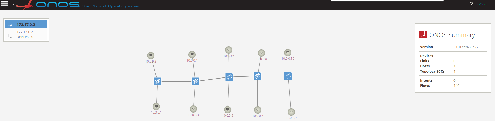

# Solutions to tasks of Demo4

## Demo4

##### **Note**: I used shell scripts to finish the tasks. The shell scripts can be found in /scripts folder. Each execution of shell script is under this path.
* Before I executed each python scripts, I ran
    ```bash
    $ sudo bash clean-ns.sh
    ```
    to clean and exit previous namespaces, bridges and links.

### Task 3.1

* Before creating rules, the topology needs to be created by running
    ```bash
    $ sudo bash demo4-3.1.sh
    ```

##### • Create the first flow rule to block the ICMP traffic from the "Blue" namespace to the "Red" namespace.

As the requirement said, we need to add a flow rule at the switch connected to the "Red" namespace(10.0.0.2), which is br-1, to tell it to drop the ICMP packets from the "blue" namespace(10.0.0.3).

* command used: 
    ```bash
    $ sudo ovs-ofctl --protocols=OpenFlow13 add-flow br-1 priority=40000,icmp,nw_src=10.0.0.3,nw_dst=10.0.0.2,action=drop
    ```
* output:
    ```
    haibipeng@ubuntu:~$ sudo ovs-ofctl --protocols=OpenFlow13 add-flow br-1 priority=40000,icmp,nw_src=10.0.0.3,nw_dst=10.0.0.2,action=drop
    haibipeng@ubuntu:~$ sudo ovs-ofctl --protocols=OpenFlow13 dump-flows br-1
    cookie=0x100002e1642f9, duration=2627.722s, table=0, n_packets=24, n_bytes=2352, send_flow_rem priority=5,ip actions=CONTROLLER:65535,clear_actions
    cookie=0x100006fc84439, duration=2627.722s, table=0, n_packets=847, n_bytes=118580, send_flow_rem priority=40000,dl_type=0x8942 actions=CONTROLLER:65535,clear_actions
    cookie=0x10000e25fc53f, duration=2627.721s, table=0, n_packets=847, n_bytes=118580, send_flow_rem priority=40000,dl_type=0x88cc actions=CONTROLLER:65535,clear_actions
    cookie=0x10000f0eaeaaa, duration=2627.710s, table=0, n_packets=10, n_bytes=420, send_flow_rem priority=40000,arp actions=CONTROLLER:65535,clear_actions
    cookie=0x0, duration=0.630s, table=0, n_packets=0, n_bytes=0, priority=40000,icmp,nw_src=10.0.0.3,nw_dst=10.0.0.2 actions=drop
    haibipeng@ubuntu:~$ sudo ip netns exec blue ping -c 1 10.0.0.2
    PING 10.0.0.2 (10.0.0.2) 56(84) bytes of data.

    --- 10.0.0.2 ping statistics ---
    1 packets transmitted, 0 received, 100% packet loss, time 0ms
    ```

##### • Create the second flow rule to block the traffic to the "Red" namespace.

As the requirement said, we need to add a flow rule at the switch connected to the "Red" namespace(10.0.0.2), which is br-1, to tell it to drop all kinds of packets from all other namespaces.

* command used: 
    ```bash
    $ sudo ovs-ofctl --protocols=OpenFlow13 add-flow br-1 priority=40000,nw_dst=10.0.0.2,action=drop
    ```
* output:
    ```
    haibipeng@ubuntu:~$ sudo ovs-ofctl --protocols=OpenFlow13 add-flow br-1 priority=40000,nw_dst=10.0.0.2,action=drop
    2022-03-19T10:10:37Z|00001|ofp_match|INFO|normalization changed ofp_match, details:
    2022-03-19T10:10:37Z|00002|ofp_match|INFO| pre: nw_dst=10.0.0.2
    2022-03-19T10:10:37Z|00003|ofp_match|INFO|post:
    haibipeng@ubuntu:~$ sudo ovs-ofctl --protocols=OpenFlow13 dump-flows br-1
    cookie=0x100006fc84439, duration=0.571s, table=0, n_packets=1052, n_bytes=147280, send_flow_rem priority=40000,dl_type=0x8942 actions=CONTROLLER:65535,clear_actions
    cookie=0x10000e25fc53f, duration=0.571s, table=0, n_packets=1052, n_bytes=147280, send_flow_rem priority=40000,dl_type=0x88cc actions=CONTROLLER:65535,clear_actions
    cookie=0x100002e1642f9, duration=0.571s, table=0, n_packets=26, n_bytes=2548, send_flow_rem priority=5,ip actions=CONTROLLER:65535,clear_actions
    cookie=0x10000f0eaeaaa, duration=0.567s, table=0, n_packets=13, n_bytes=546, send_flow_rem priority=40000,arp actions=CONTROLLER:65535,clear_actions
    cookie=0x0, duration=25.067s, table=0, n_packets=1, n_bytes=98, priority=40000 actions=drop
    haibipeng@ubuntu:~$ sudo ip netns exec blue ping -c 1 10.0.0.2
    PING 10.0.0.2 (10.0.0.2) 56(84) bytes of data.

    --- 10.0.0.2 ping statistics ---
    1 packets transmitted, 0 received, 100% packet loss, time 0ms
    ```


##### • Create the third flow rule to allow total access to the "Red" namespace from the "Green" and the “Blue" namespaces.

As the requirement said, we need to add a flow rule at the switch connected to the "Red" namespace(10.0.0.2), which is br-1, to tell it to allow all kinds of packets from the "blue" namespace(10.0.0.3).

* command used: 
    ```bash
    $ sudo ovs-ofctl --protocols=OpenFlow13 add-flow br-1 priority=40000,nw_src=10.0.0.3,nw_dst=10.0.0.2,action=all
    ```
* output:
    ```
    haibipeng@ubuntu:~$ sudo ovs-ofctl --protocols=OpenFlow13 add-flow br-1 priority=40000,nw_src=10.0.0.3,nw_dst=10.0.0.2,action=all
    2022-03-19T12:11:29Z|00001|ofp_match|INFO|normalization changed ofp_match, details:
    2022-03-19T12:11:29Z|00002|ofp_match|INFO| pre: nw_src=10.0.0.3,nw_dst=10.0.0.2
    2022-03-19T12:11:29Z|00003|ofp_match|INFO|post: 
    haibipeng@ubuntu:~$ sudo ovs-ofctl --protocols=OpenFlow13 dump-flows br-1
    cookie=0x10000e25fc53f, duration=0.910s, table=0, n_packets=1571, n_bytes=219940, send_flow_rem priority=40000,dl_type=0x88cc actions=CONTROLLER:65535,clear_actions
    cookie=0x100006fc84439, duration=0.910s, table=0, n_packets=1571, n_bytes=219940, send_flow_rem priority=40000,dl_type=0x8942 actions=CONTROLLER:65535,clear_actions
    cookie=0x100002e1642f9, duration=0.910s, table=0, n_packets=26, n_bytes=2548, send_flow_rem priority=5,ip actions=CONTROLLER:65535,clear_actions
    cookie=0x10000f0eaeaaa, duration=0.908s, table=0, n_packets=23, n_bytes=966, send_flow_rem priority=40000,arp actions=CONTROLLER:65535,clear_actions
    cookie=0x0, duration=2.878s, table=0, n_packets=10, n_bytes=942, priority=40000 actions=ALL
    haibipeng@ubuntu:~$ sudo ip netns exec blue ping -c 1 10.0.0.2
    PING 10.0.0.2 (10.0.0.2) 56(84) bytes of data.
    64 bytes from 10.0.0.2: icmp_seq=1 ttl=64 time=5.82 ms

    --- 10.0.0.2 ping statistics ---
    1 packets transmitted, 1 received, 0% packet loss, time 0ms
    rtt min/avg/max/mdev = 5.824/5.824/5.824/0.000 ms
    haibipeng@ubuntu:~$ sudo ip netns exec green ping -c 1 10.0.0.2
    PING 10.0.0.2 (10.0.0.2) 56(84) bytes of data.
    64 bytes from 10.0.0.2: icmp_seq=1 ttl=64 time=8.23 ms

    --- 10.0.0.2 ping statistics ---
    1 packets transmitted, 1 received, 0% packet loss, time 0ms
    rtt min/avg/max/mdev = 8.234/8.234/8.234/0.000 ms
    ```


##### • Do you need to delete the second flow rule to activate the third flow rule?

No. As we can see from the output of the third rule, the second flow rule was overwritten by the third flow rule. Also the "Green" and "Blue" namespaces could ping the "Red" namespace successfully.


##### • Create a flow rule to allow only Http and Https traffic to the "Red" namespace.

> As the requirement said, we need to add a flow rule at the switch connected to the "Red" namespace(10.0.0.2), which is br-1, to tell it to allow only HTTP and HTTPS packets from other namespaces.
First, based on the conclusion of question 4, we can first block all kinds of traffic and allow only HTTP and HTTPS traffic to the "Red" namespace, which can be specified as:
> * Allowed protocl: tcp
> * Allowed ports: 80(HTTP) and 443(HTTPS)
> * Allowed destination: 10.0.0.2

* scripts:
    ```bash
    #!/usr/bin/env bash

    # block all kinds of packets
    sudo ovs-ofctl --protocols=OpenFlow13 add-flow br-1 ip,nw_dst=10.0.0.2,action=drop
    sudo ovs-ofctl --protocols=OpenFlow13 add-flow br-1 ipv6,action=drop
    sudo ovs-ofctl --protocols=OpenFlow13 add-flow br-1 arp,nw_dst=10.0.0.2,action=drop
    sudo ovs-ofctl --protocols=OpenFlow13 add-flow br-1 rarp,nw_dst=10.0.0.2,action=drop
    sudo ovs-ofctl --protocols=OpenFlow13 add-flow br-1 mpls,action=drop
    sudo ovs-ofctl --protocols=OpenFlow13 add-flow br-1 mplsm,action=drop

    # only all http/https traffic(tcp, port 80 and 443)
    sudo ovs-ofctl --protocols=OpenFlow13 add-flow br-1 tcp,tcp_src=80/443,tcp_dst=80/443,nw_dst=10.0.0.2,action=all

    #
    sudo ovs-ofctl --protocols=OpenFlow13 dump-flows br-1

    # test, e.g., icmp packets
    sudo ip netns exec green ping -c 1 10.0.0.2
    ```

* command used: 
    ```bash
    $ sudo bash task3.1.5.sh
    ```
* output:
    ```
    haibipeng@ubuntu:~/Downloads/SDN_demos/Demo4/Demo4_solutions_Haibi_Peng_875552/scripts$ sudo bash task3.1.5.sh
    haibipeng@ubuntu:~/Downloads/SDN_demos/Demo4/Demo4_solutions_Haibi_Peng_875552/scripts$ sudo ovs-ofctl --protocols=OpenFlow13 dump-flows br-1
    cookie=0x10000ed2c870c, duration=3938.040s, table=0, n_packets=60, n_bytes=5176, send_flow_rem priority=5,ip actions=CONTROLLER:65535,clear_actions
    cookie=0x100008988eb56, duration=3938.040s, table=0, n_packets=1272, n_bytes=178080, send_flow_rem priority=40000,dl_type=0x8942 actions=CONTROLLER:65535,clear_actions
    cookie=0x10000befe9702, duration=3938.040s, table=0, n_packets=1272, n_bytes=178080, send_flow_rem priority=40000,dl_type=0x88cc actions=CONTROLLER:65535,clear_actions
    cookie=0x10000d8c8a6c0, duration=3937.999s, table=0, n_packets=28, n_bytes=1176, send_flow_rem priority=40000,arp actions=CONTROLLER:65535,clear_actions
    cookie=0x0, duration=1.838s, table=0, n_packets=0, n_bytes=0, ipv6 actions=drop
    cookie=0x0, duration=1.777s, table=0, n_packets=0, n_bytes=0, mpls actions=drop
    cookie=0x0, duration=1.757s, table=0, n_packets=0, n_bytes=0, mplsm actions=drop
    cookie=0x0, duration=1865.703s, table=0, n_packets=0, n_bytes=0, priority=40000,rarp,arp_tpa=10.0.0.2 actions=drop
    cookie=0x0, duration=1.858s, table=0, n_packets=0, n_bytes=0, ip,nw_dst=10.0.0.2 actions=drop
    cookie=0x0, duration=1.817s, table=0, n_packets=0, n_bytes=0, arp,arp_tpa=10.0.0.2 actions=drop
    cookie=0x0, duration=1.797s, table=0, n_packets=0, n_bytes=0, rarp,arp_tpa=10.0.0.2 actions=drop
    cookie=0x0, duration=1.737s, table=0, n_packets=0, n_bytes=0, tcp,nw_dst=10.0.0.2,tp_src=0x10/0x1bb,tp_dst=0x10/0x1bb actions=ALL
    cookie=0xaa0000447f4fa8, duration=18.152s, table=0, n_packets=1, n_bytes=98, send_flow_rem priority=10,in_port="br-ovs12",dl_src=a6:40:bb:1a:f7:85,dl_dst=4e:4a:02:3f:61:89 actions=output:"veth-red-br"
    cookie=0xaa00002d0fa4f1, duration=18.151s, table=0, n_packets=1, n_bytes=98, send_flow_rem priority=10,in_port="veth-red-br",dl_src=4e:4a:02:3f:61:89,dl_dst=a6:40:bb:1a:f7:85 actions=output:"br-ovs12"
    haibipeng@ubuntu:~/Downloads/SDN_demos/Demo4/Demo4_solutions_Haibi_Peng_875552/scripts$ sudo ip netns exec green sudo ping -c 1 10.0.0.2
    PING 10.0.0.2 (10.0.0.2) 56(84) bytes of data.

    --- 10.0.0.2 ping statistics ---
    1 packets transmitted, 0 received, 100% packet loss, time 0ms
    ```


### Task 3.2
  
##### • Create a linear topology of 5 switches and 10 hosts (as in Fig. 6). In a linear topology, each switch has two connections with other switches except the first and the last ones. Each switch contains two hosts, one for the “Red" slice and one for the “Blue" slice.

I used similar code from Demo_2_3 to create a linear topology as described in question 1.

* command used: 
    ```bash
    $ sudo bash demo4-3.2.sh
    ```
* output:
    ```
    Creating the OVS bridge br-1
    Attaching the OVS bridge to the ONOS controller
    Creating the OVS bridge br-2
    Attaching the OVS bridge to the ONOS controller
    Creating the OVS bridge br-3
    Attaching the OVS bridge to the ONOS controller
    Creating the OVS bridge br-4
    Attaching the OVS bridge to the ONOS controller
    Creating the OVS bridge br-5
    Attaching the OVS bridge to the ONOS controller
    Creating the namespace ns-1
    Attaching the namespace ns-1 to the OVS br-1
    Creating the namespace ns-2
    Attaching the namespace ns-2 to the OVS br-1
    Creating the namespace ns-3
    Attaching the namespace ns-3 to the OVS br-2
    Creating the namespace ns-4
    Attaching the namespace ns-4 to the OVS br-2
    Creating the namespace ns-5
    Attaching the namespace ns-5 to the OVS br-3
    Creating the namespace ns-6
    Attaching the namespace ns-6 to the OVS br-3
    Creating the namespace ns-7
    Attaching the namespace ns-7 to the OVS br-4
    Creating the namespace ns-8
    Attaching the namespace ns-8 to the OVS br-4
    Creating the namespace ns-9
    Attaching the namespace ns-9 to the OVS br-5
    Creating the namespace ns-10
    Attaching the namespace ns-10 to the OVS br-5
    Attaching the OVS br-1 to the OVS br-2
    Attaching the OVS br-2 to the OVS br-3
    Attaching the OVS br-3 to the OVS br-4
    Attaching the OVS br-4 to the OVS br-5
    PING 10.0.0.10 (10.0.0.10) 56(84) bytes of data.

    --- 10.0.0.10 ping statistics ---
    1 packets transmitted, 0 received, 100% packet loss, time 0ms

    PING 10.0.0.10 (10.0.0.10) 56(84) bytes of data.

    --- 10.0.0.10 ping statistics ---
    1 packets transmitted, 0 received, 100% packet loss, time 0ms

    PING 10.0.0.10 (10.0.0.10) 56(84) bytes of data.
    64 bytes from 10.0.0.10: icmp_seq=1 ttl=64 time=35.6 ms

    --- 10.0.0.10 ping statistics ---
    1 packets transmitted, 1 received, 0% packet loss, time 0ms
    rtt min/avg/max/mdev = 35.593/35.593/35.593/0.000 ms
    PING 10.0.0.10 (10.0.0.10) 56(84) bytes of data.
    64 bytes from 10.0.0.10: icmp_seq=1 ttl=64 time=61.1 ms

    --- 10.0.0.10 ping statistics ---
    1 packets transmitted, 1 received, 0% packet loss, time 0ms
    rtt min/avg/max/mdev = 61.123/61.123/61.123/0.000 ms
    PING 10.0.0.10 (10.0.0.10) 56(84) bytes of data.
    64 bytes from 10.0.0.10: icmp_seq=1 ttl=64 time=46.8 ms

    --- 10.0.0.10 ping statistics ---
    1 packets transmitted, 1 received, 0% packet loss, time 0ms
    rtt min/avg/max/mdev = 46.843/46.843/46.843/0.000 ms
    PING 10.0.0.10 (10.0.0.10) 56(84) bytes of data.
    64 bytes from 10.0.0.10: icmp_seq=1 ttl=64 time=41.5 ms

    --- 10.0.0.10 ping statistics ---
    1 packets transmitted, 1 received, 0% packet loss, time 0ms
    rtt min/avg/max/mdev = 41.459/41.459/41.459/0.000 ms
    PING 10.0.0.10 (10.0.0.10) 56(84) bytes of data.
    64 bytes from 10.0.0.10: icmp_seq=1 ttl=64 time=34.5 ms

    --- 10.0.0.10 ping statistics ---
    1 packets transmitted, 1 received, 0% packet loss, time 0ms
    rtt min/avg/max/mdev = 34.540/34.540/34.540/0.000 ms
    PING 10.0.0.10 (10.0.0.10) 56(84) bytes of data.
    64 bytes from 10.0.0.10: icmp_seq=1 ttl=64 time=48.6 ms

    --- 10.0.0.10 ping statistics ---
    1 packets transmitted, 1 received, 0% packet loss, time 0ms
    rtt min/avg/max/mdev = 48.618/48.618/48.618/0.000 ms
    PING 10.0.0.10 (10.0.0.10) 56(84) bytes of data.
    64 bytes from 10.0.0.10: icmp_seq=1 ttl=64 time=41.1 ms

    --- 10.0.0.10 ping statistics ---
    1 packets transmitted, 1 received, 0% packet loss, time 0ms
    rtt min/avg/max/mdev = 41.133/41.133/41.133/0.000 ms
    ```
    * graph:
    


##### • After creating this topology, you are asked to create two slices, “Red" and “Blue", each slice is totally separated from the other without any toleration for shared access between them. To do that, you may write a shell script or a python-based code, your code must be well-commented and following coding principles and naming conventions. Your solution may leverage OVS’s CLI to create the necessary flow rules. Note that all hosts are in the same network range.

As question 2 describes, I wrote a shell script to create a rule, which is to block the packets from ns-1, 3, 5, 7, 9 to ns-2, 4, 6, 8, 10 and vice versa.

* shell script
    ```bash
    #!/usr/bin/env bash

    for (( i=1; i<=5; i++))
    do
        for (( j=1; j<=5; j++))
        do
            sudo ovs-ofctl --protocols=OpenFlow13 add-flow br-$i priority=40000,icmp,nw_src=10.0.0.$((2*$i)),nw_dst=10.0.0.$((2*$j-1)),action=drop
            sudo ovs-ofctl --protocols=OpenFlow13 add-flow br-$i priority=40000,icmp,nw_src=10.0.0.$((2*$i-1)),nw_dst=10.0.0.$((2*$j)),action=drop
        done
    done

    # check flow entries of e.g., br-1
    sudo ovs-ofctl --protocols=OpenFlow13 dump-flows br-1
    # ping failed
    sudo ip netns exec ns-1 ping -c 1 10.0.0.2
    # ping successful
    sudo ip netns exec ns-1 ping -c 1 10.0.0.3
    ```

* command used: 
    ```bash
    $ sudo bash slice1.sh
    ```
* output:
    ```
    haibipeng@ubuntu:~/Downloads/SDN_demos/Demo4/Demo4_solutions_Haibi_Peng_875552/scripts$ sudo bash slice1.sh
    cookie=0x100005017764e, duration=4005.662s, table=0, n_packets=39, n_bytes=3822, send_flow_rem priority=5,ip actions=CONTROLLER:65535,clear_actions
    cookie=0x10000f01e8595, duration=4005.662s, table=0, n_packets=1294, n_bytes=182454, send_flow_rem priority=40000,dl_type=0x8942 actions=CONTROLLER:65535,clear_actions
    cookie=0x100007451cdfa, duration=4005.662s, table=0, n_packets=1294, n_bytes=182454, send_flow_rem priority=40000,dl_type=0x88cc actions=CONTROLLER:65535,clear_actions
    cookie=0x100008dac7183, duration=4005.643s, table=0, n_packets=25, n_bytes=1050, send_flow_rem priority=40000,arp actions=CONTROLLER:65535,clear_actions
    cookie=0x0, duration=1.007s, table=0, n_packets=0, n_bytes=0, priority=40000,icmp,nw_src=10.0.0.2,nw_dst=10.0.0.1 actions=drop
    cookie=0x0, duration=0.984s, table=0, n_packets=0, n_bytes=0, priority=40000,icmp,nw_src=10.0.0.1,nw_dst=10.0.0.2 actions=drop
    cookie=0x0, duration=0.961s, table=0, n_packets=0, n_bytes=0, priority=40000,icmp,nw_src=10.0.0.2,nw_dst=10.0.0.3 actions=drop
    cookie=0x0, duration=0.939s, table=0, n_packets=0, n_bytes=0, priority=40000,icmp,nw_src=10.0.0.1,nw_dst=10.0.0.4 actions=drop
    cookie=0x0, duration=0.919s, table=0, n_packets=0, n_bytes=0, priority=40000,icmp,nw_src=10.0.0.2,nw_dst=10.0.0.5 actions=drop
    cookie=0x0, duration=0.898s, table=0, n_packets=0, n_bytes=0, priority=40000,icmp,nw_src=10.0.0.1,nw_dst=10.0.0.6 actions=drop
    cookie=0x0, duration=0.878s, table=0, n_packets=0, n_bytes=0, priority=40000,icmp,nw_src=10.0.0.2,nw_dst=10.0.0.7 actions=drop
    cookie=0x0, duration=0.858s, table=0, n_packets=0, n_bytes=0, priority=40000,icmp,nw_src=10.0.0.1,nw_dst=10.0.0.8 actions=drop
    cookie=0x0, duration=0.838s, table=0, n_packets=0, n_bytes=0, priority=40000,icmp,nw_src=10.0.0.2,nw_dst=10.0.0.9 actions=drop
    cookie=0x0, duration=0.817s, table=0, n_packets=0, n_bytes=0, priority=40000,icmp,nw_src=10.0.0.1,nw_dst=10.0.0.10 actions=drop
    PING 10.0.0.2 (10.0.0.2) 56(84) bytes of data.

    --- 10.0.0.2 ping statistics ---
    1 packets transmitted, 0 received, 100% packet loss, time 0ms

    PING 10.0.0.3 (10.0.0.3) 56(84) bytes of data.
    64 bytes from 10.0.0.3: icmp_seq=1 ttl=64 time=5.77 ms

    --- 10.0.0.3 ping statistics ---
    1 packets transmitted, 1 received, 0% packet loss, time 0ms
    rtt min/avg/max/mdev = 5.765/5.765/5.765/0.000 ms
    ```


##### • Redo the isolation using another approach that differs from the one you have used

Basically, the essence of the isolation is also to create flow entries that block the packets from ns-1, 3, 5, 7, 9 to ns-2, 4, 6, 8, 10 and vice versa, but in this question I managed to use the bundle feature to add flow entries to switch's tables.

* shell script
    ```bash
    #!/usr/bin/env bash

    # add flow entries in bundle
    for (( i=1; i<=5; i++))
    do
        sudo ovs-ofctl --protocols=OpenFlow13 --bundle add-flows br-$i bundle.txt 
    done

    # check flow entries of e.g., br-1
    sudo ovs-ofctl --protocols=OpenFlow13 dump-flows br-1
    # ping failed
    sudo ip netns exec ns-1 ping -c 1 10.0.0.2
    # ping successful
    sudo ip netns exec ns-1 ping -c 1 10.0.0.3
    ```

* command used: 
    ```bash
    $ sudo bash slice2.sh
    ```
* output:
    ```
    haibipeng@ubuntu:~/Downloads/SDN_demos/Demo4/Demo4_solutions_Haibi_Peng_875552/scripts$ sudo bash slice2.sh
    cookie=0x100005017764e, duration=11.106s, table=0, n_packets=0, n_bytes=0, send_flow_rem priority=5,ip actions=CONTROLLER:65535,clear_actions
    cookie=0x100007451cdfa, duration=11.106s, table=0, n_packets=3, n_bytes=423, send_flow_rem priority=40000,dl_type=0x88cc actions=CONTROLLER:65535,clear_actions
    cookie=0x10000f01e8595, duration=11.106s, table=0, n_packets=3, n_bytes=423, send_flow_rem priority=40000,dl_type=0x8942 actions=CONTROLLER:65535,clear_actions
    cookie=0x100008dac7183, duration=11.106s, table=0, n_packets=0, n_bytes=0, send_flow_rem priority=40000,arp actions=CONTROLLER:65535,clear_actions
    cookie=0x0, duration=0.171s, table=0, n_packets=0, n_bytes=0, priority=40000,icmp,nw_src=10.0.0.1,nw_dst=10.0.0.2 actions=drop
    cookie=0x0, duration=0.171s, table=0, n_packets=0, n_bytes=0, priority=40000,icmp,nw_src=10.0.0.1,nw_dst=10.0.0.4 actions=drop
    cookie=0x0, duration=0.171s, table=0, n_packets=0, n_bytes=0, priority=40000,icmp,nw_src=10.0.0.1,nw_dst=10.0.0.6 actions=drop
    ......
    PING 10.0.0.2 (10.0.0.2) 56(84) bytes of data.

    --- 10.0.0.2 ping statistics ---
    1 packets transmitted, 0 received, 100% packet loss, time 0ms

    PING 10.0.0.3 (10.0.0.3) 56(84) bytes of data.
    64 bytes from 10.0.0.3: icmp_seq=1 ttl=64 time=7.22 ms

    --- 10.0.0.3 ping statistics ---
    1 packets transmitted, 1 received, 0% packet loss, time 0ms
    rtt min/avg/max/mdev = 7.220/7.220/7.220/0.000 ms
    ```


# Reference
1. [Open vSwitch Manual ovs-ofctl(8)](https://www.openvswitch.org/support/dist-docs-2.5/ovs-ofctl.8.txt)