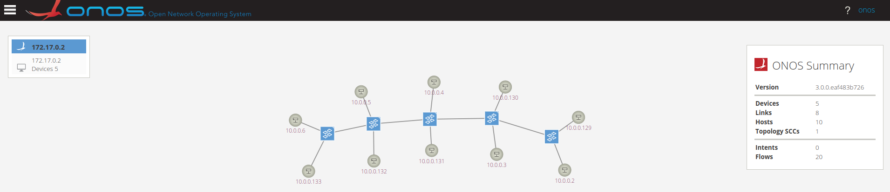

# Solutions to tasks of Demo5

## Demo5

##### **Note**: I used python scripts to finish the tasks. The python scripts can be found in /scripts folder. Each execution of python script is under this path.

### Task 1

* command used: 
    ```bash
    $ sudo python3 task1.py
    ```
* output:
    ```
    haibipeng@ubuntu:~/Downloads/SDN_demos/demo5/Demo5_solutions_Haibi_Peng_875552/scripts$ sudo python3 task1.py
    Activated : org.onosproject.hostprovider 
    Activated : org.onosproject.mobility 
    Activated : org.onosproject.lldpprovider 
    Activated : org.onosproject.ofagent 
    Activated : org.onosproject.openflow 
    Activated : org.onosproject.roadm 
    Activated : org.onosproject.proxyarp 
    Activated : org.onosproject.fwd
    ```

### Task2

* Before using Python APIs, the topology needs to be created by running
    ```bash
    $ sudo bash demo5.sh
    ```

* topology:
    

#### Task2.1

* command used: 
    ```bash
    $ sudo python3 task2.1.py
    ```
* output:
    ```
    haibipeng@ubuntu:~/Downloads/SDN_demos/demo5/Demo5_solutions_Haibi_Peng_875552/scripts$ sudo python3 task2.1.py
    Device 1 id: of:00000a3a67d42346 
    Device 2 id: of:0000aa0dbd1e8549 
    Device 3 id: of:0000f29dc116ea40 
    Device 4 id: of:00007215ea69354e 
    Device 5 id: of:0000ca7ed212ea4d
    ```

#### Task2.2

* command used: 
    ```bash
    $ sudo python3 task2.2.py
    ```
* output:
    ```
    haibipeng@ubuntu:~/Downloads/SDN_demos/demo5/Demo5_solutions_Haibi_Peng_875552/scripts$ sudo python3 task2.2.py
    IP management address: 172.17.0.1
    OpenFlow version: OF_13
    ```

#### Task2.3

* command used: 
    ```bash
    $ sudo python3 task2.3.py
    ```
* output:
    ```
    haibipeng@ubuntu:~/Downloads/SDN_demos/demo5/Demo5_solutions_Haibi_Peng_875552/scripts$ sudo python3 task2.3.py
    Active ports:
    Mac address of port 4: 86:c3:a0:09:56:f6
    Port name of port 4: br-ovs54
    Mac address of port 5: 2a:41:ab:cd:02:50
    Port name of port 5: veth-red5-br
    Mac address of port 6: 96:31:81:a5:9b:68
    Port name of port 6: veth-blue5-br
    ```

### Task3

#### Task3.1

* command used: 
    ```bash
    $ sudo python3 task3.1.py
    ```
* output:
    ```
    haibipeng@ubuntu:~/Downloads/SDN_demos/demo5/Demo5_solutions_Haibi_Peng_875552/scripts$ sudo python3 task3.1.py
    Host 1: {'id': '06:09:A1:EB:2D:60/None', 'Mac address': '06:09:A1:EB:2D:60', 'IP addresses': ['10.0.0.4']}
    Host 2: {'id': '8E:25:38:8D:CC:3B/None', 'Mac address': '8E:25:38:8D:CC:3B', 'IP addresses': ['10.0.0.5']}
    Host 3: {'id': '2E:1F:C0:3B:CA:26/None', 'Mac address': '2E:1F:C0:3B:CA:26', 'IP addresses': ['10.0.0.133']}
    Host 4: {'id': '82:89:C9:3D:34:C1/None', 'Mac address': '82:89:C9:3D:34:C1', 'IP addresses': ['10.0.0.2']}
    Host 5: {'id': '22:34:87:DA:A4:A3/None', 'Mac address': '22:34:87:DA:A4:A3', 'IP addresses': ['10.0.0.131']}
    Host 6: {'id': '9A:A3:94:7F:CF:85/None', 'Mac address': '9A:A3:94:7F:CF:85', 'IP addresses': ['10.0.0.3']}
    Host 7: {'id': '2E:6A:63:75:00:5A/None', 'Mac address': '2E:6A:63:75:00:5A', 'IP addresses': ['10.0.0.132']}
    Host 8: {'id': '7A:1E:7F:53:99:85/None', 'Mac address': '7A:1E:7F:53:99:85', 'IP addresses': ['10.0.0.129']}
    Host 9: {'id': '9E:BD:DF:85:20:25/None', 'Mac address': '9E:BD:DF:85:20:25', 'IP addresses': ['10.0.0.130']}
    Host 10: {'id': '5E:E5:44:3E:CF:5A/None', 'Mac address': '5E:E5:44:3E:CF:5A', 'IP addresses': ['10.0.0.6']}
    ```

#### Task3.2

* command used: 
    ```bash
    $ sudo python3 task3.2.py
    ```
* output:
    ```
    haibipeng@ubuntu:~/Downloads/SDN_demos/demo5/Demo5_solutions_Haibi_Peng_875552/scripts$ sudo python3 task3.2.py
    Device id and the port used by the host having “10.0.0.130" as an IP address:
    Device id 1: of:0000f29dc116ea40
    Port number 1: 6
    ```

#### Task3.3

* command used: 
    ```bash
    $ sudo python3 task3.3.py
    ```
* output:
    ```
    haibipeng@ubuntu:~/Downloads/SDN_demos/demo5/Demo5_solutions_Haibi_Peng_875552/scripts$ sudo python3 task3.3.py
    <Response [204]>
    {'code': 404, 'message': 'Host is not found'}
    ```

#### Task3.4

Ping the removed host, I observed that it still could be pinged, and the deleted host recovered from the ping.

* command used: 
    ```bash
    $ sudo ip netns exec red1 ping -c 1 10.0.0.130
    ```
* output:
    ```
    haibipeng@ubuntu:~/Downloads/SDN_demos/demo5/Demo5_solutions_Haibi_Peng_875552/scripts$ sudo ip netns exec red1 ping -c 1 10.0.0.130
    PING 10.0.0.130 (10.0.0.130) 56(84) bytes of data.
    64 bytes from 10.0.0.130: icmp_seq=1 ttl=64 time=7.53 ms

    --- 10.0.0.130 ping statistics ---
    1 packets transmitted, 1 received, 0% packet loss, time 0ms
    rtt min/avg/max/mdev = 7.526/7.526/7.526/0.000 ms
    ```

### Task4

#### Task4.1

* command used: 
    ```bash
    $ sudo python3 task4.1.py
    ```
* output:
    ```
    haibipeng@ubuntu:~/Downloads/SDN_demos/demo5/Demo5_solutions_Haibi_Peng_875552/scripts$ sudo python3 task4.1.py
    Active links:
       device_id_src    port_src   device_id_dst    port_dst
    of:0000f29dc116ea40    2    of:0000ca7ed212ea4d    2
    of:0000f29dc116ea40    1    of:0000aa0dbd1e8549    1
    of:0000ca7ed212ea4d    2    of:0000f29dc116ea40    2
    of:0000ca7ed212ea4d    3    of:00007215ea69354e    3
    of:00000a3a67d42346    4    of:00007215ea69354e    4
    of:00007215ea69354e    3    of:0000ca7ed212ea4d    3
    of:00007215ea69354e    4    of:00000a3a67d42346    4
    of:0000aa0dbd1e8549    1    of:0000f29dc116ea40    1
    ```

#### Task4.2

* command used: 
    ```bash
    $ sudo python3 task4.2.py
    ```
* output:
    ```
    haibipeng@ubuntu:~/Downloads/SDN_demos/demo5/Demo5_solutions_Haibi_Peng_875552/scripts$ sudo python3 task4.2.py
    Flows:
        flow_id         application_id          device_id                      instructions
    281476238277508  org.onosproject.core  of:00000a3a67d42346  [{'type': 'OUTPUT', 'port': 'CONTROLLER'}]
    281477669980962  org.onosproject.core  of:00000a3a67d42346  [{'type': 'OUTPUT', 'port': 'CONTROLLER'}]
    281475327302180  org.onosproject.core  of:00000a3a67d42346  [{'type': 'OUTPUT', 'port': 'CONTROLLER'}]
    281474982615923  org.onosproject.core  of:00000a3a67d42346  [{'type': 'OUTPUT', 'port': 'CONTROLLER'}]
    281478719052243  org.onosproject.core  of:0000aa0dbd1e8549  [{'type': 'OUTPUT', 'port': 'CONTROLLER'}]
    281476600830051  org.onosproject.core  of:0000aa0dbd1e8549  [{'type': 'OUTPUT', 'port': 'CONTROLLER'}]
    281476215469673  org.onosproject.core  of:0000aa0dbd1e8549  [{'type': 'OUTPUT', 'port': 'CONTROLLER'}]
    281477669832949  org.onosproject.core  of:0000aa0dbd1e8549  [{'type': 'OUTPUT', 'port': 'CONTROLLER'}]
    281476012873359  org.onosproject.core  of:0000f29dc116ea40  [{'type': 'OUTPUT', 'port': 'CONTROLLER'}]
    281476488721326  org.onosproject.core  of:0000f29dc116ea40  [{'type': 'OUTPUT', 'port': 'CONTROLLER'}]
    281478693724358  org.onosproject.core  of:0000f29dc116ea40  [{'type': 'OUTPUT', 'port': 'CONTROLLER'}]
    281477680228205  org.onosproject.core  of:0000f29dc116ea40  [{'type': 'OUTPUT', 'port': 'CONTROLLER'}]
    281477699694982  org.onosproject.core  of:00007215ea69354e  [{'type': 'OUTPUT', 'port': 'CONTROLLER'}]
    281476890315789  org.onosproject.core  of:00007215ea69354e  [{'type': 'OUTPUT', 'port': 'CONTROLLER'}]
    281475775110370  org.onosproject.core  of:00007215ea69354e  [{'type': 'OUTPUT', 'port': 'CONTROLLER'}]
    281475242553955  org.onosproject.core  of:00007215ea69354e  [{'type': 'OUTPUT', 'port': 'CONTROLLER'}]
    281475541958029  org.onosproject.core  of:0000ca7ed212ea4d  [{'type': 'OUTPUT', 'port': 'CONTROLLER'}]
    281477243926964  org.onosproject.core  of:0000ca7ed212ea4d  [{'type': 'OUTPUT', 'port': 'CONTROLLER'}]
    281477935919836  org.onosproject.core  of:0000ca7ed212ea4d  [{'type': 'OUTPUT', 'port': 'CONTROLLER'}]
    281477602150891  org.onosproject.core  of:0000ca7ed212ea4d  [{'type': 'OUTPUT', 'port': 'CONTROLLER'}]
    ```

#### Task4.3

* command used: 
    ```bash
    $ sudo python3 task4.3.py
    ```
* output:
    ```
    haibipeng@ubuntu:~/Downloads/SDN_demos/demo5/Demo5_solutions_Haibi_Peng_875552/scripts$ sudo python3 task4.3.py
    All intents:
    intents 1: {'type': 'HostToHostIntent', 'id': '0x0', 'key': '0x0', 'appId': 'org.onosproject.cli', 'resources': ['9A:A3:94:7F:CF:85/None', '9E:BD:DF:85:20:25/None'], 'state': 'INSTALLED'}
    intents 2: {'type': 'HostToHostIntent', 'id': '0x5', 'key': '0x5', 'appId': 'org.onosproject.cli', 'resources': ['9A:A3:94:7F:CF:85/None', '8E:25:38:8D:CC:3B/None'], 'state': 'INSTALLED'}
    ```
