# Solutions to tasks of Demo5

## Demo5

##### **Note**: I used python scripts to finish the tasks. The python scripts can be found in /scripts folder. Each execution of python script is under this path.

### Pre Task

Use the python code created in the previous demonstration to access ONOS RESTful API interface and activate the required ONOS applications.

* command used: 
    ```bash
    $ sudo python3 pre-task.py
    ```
* output:
    ```
    haibipeng@ubuntu:~/Downloads/SDN_demos/Demo6/Demo6_solutions_Haibi_Peng_875552/scripts$ sudo python3 pre-task.py
    Activated : org.onosproject.hostprovider 
    Activated : org.onosproject.mobility 
    Activated : org.onosproject.lldpprovider 
    Activated : org.onosproject.ofagent 
    Activated : org.onosproject.openflow
    Activated : org.onosproject.roadm 
    Activated : org.onosproject.proxyarp 
    Activated : org.onosproject.fwd
    ```

### Task 1

* Before using Python APIs, the topology needs to be created by running
    ```bash
    $ sudo bash demo6.sh
    ```

* topology:
    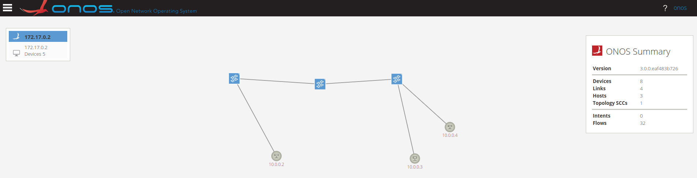

#### Task1.1

In the flow rules json, the device id(connected to blue and green) is specified. The selector criteria specify the details of the traffic, which from red to blue. Then the treatment instructions specify that the selected traffic is forwarded to green, except for to blue.

* command used: 
    ```bash
    $ sudo python3 task1.1.py
    ```
* output:
    ```
    haibipeng@ubuntu:~/Downloads/SDN_demos/Demo6/Demo6_solutions_Haibi_Peng_875552/scripts$ sudo python3 task1.1.py
    200
    ```

* The Flows for Device of:0000c61d89cfdd4c are as follows:
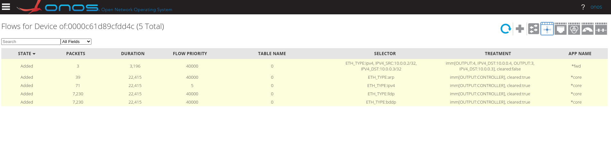

* Then ping from red to blue:
    ```
    haibipeng@ubuntu:~/Downloads/SDN_demos/Demo6/Demo6_solutions_Haibi_Peng_875552/scripts$ sudo ip netns exec red ping -c 1 10.0.0.3
    PING 10.0.0.3 (10.0.0.3) 56(84) bytes of data.
    64 bytes from 10.0.0.3: icmp_seq=1 ttl=64 time=9.31 ms

    --- 10.0.0.3 ping statistics ---
    1 packets transmitted, 1 received, 0% packet loss, time 0ms
    rtt min/avg/max/mdev = 9.314/9.314/9.314/0.000 ms
    ```

* Flows for Device of:0000c61d89cfdd4c are as follows:

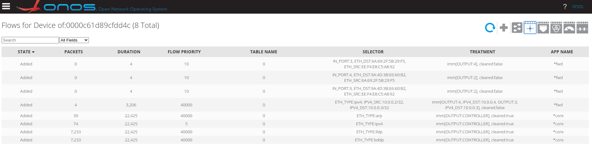

From which we can see that ***the traffic is copied to green(port 4) as well***.

#### Task1.2

In the flow rules json, the device id(connected to red) is specified. The selector criteria specify the details of the traffic, which from blue to red. Then the treatment instructions is left empty so that the selected packets will be droped.

* command used: 
    ```bash
    $ sudo python3 task1.2.py
    ```
* output:
    ```
    haibipeng@ubuntu:~/Downloads/SDN_demos/Demo6/Demo6_solutions_Haibi_Peng_875552/scripts$ sudo python3 task1.2.py
    200
    ```

* The Flows for Device of:00006600ea3e3f41 are as follows:
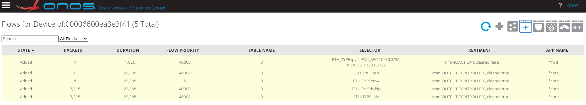

* Then ping from blue to red:
    ```
    haibipeng@ubuntu:~/Downloads/SDN_demos/Demo6/Demo6_solutions_Haibi_Peng_875552/scripts$ sudo ip netns exec blue ping -c 1 10.0.0.2
    PING 10.0.0.2 (10.0.0.2) 56(84) bytes of data.
    
    --- 10.0.0.2 ping statistics ---
    1 packets transmitted, 0 received, 100% packet loss, time 0ms
    ```

And the ICMP traffic is blocked from blue to red.

#### Task1.3

In the flow rules json, the device id(connected to red) is specified. The selector criteria specify the details of the traffic, which all traffic to red. Then the treatment instructions is left empty so that the selected packets will be droped.

* command used: 
    ```bash
    $ sudo python3 task1.3.py
    ```
* output:
    ```
    haibipeng@ubuntu:~/Downloads/SDN_demos/Demo6/Demo6_solutions_Haibi_Peng_875552/scripts$ sudo python3 task1.3.py
    200
    ```

* The Flows for Device of:00006600ea3e3f41 are as follows:
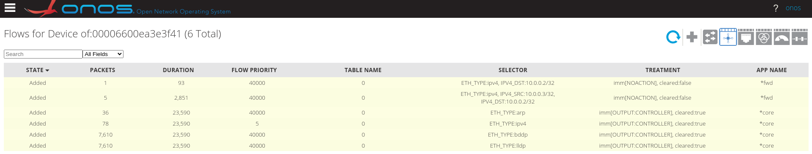

* Then ping from blue to red and from green to red:
    ```
    haibipeng@ubuntu:~/Downloads/SDN_demos/Demo6/Demo6_solutions_Haibi_Peng_875552/scripts$ sudo ip netns exec blue ping -c 1 10.0.0.2
    PING 10.0.0.2 (10.0.0.2) 56(84) bytes of data.
    
    --- 10.0.0.2 ping statistics ---
    1 packets transmitted, 0 received, 100% packet loss, time 0ms
    haibipeng@ubuntu:~/Downloads/SDN_demos/Demo6/Demo6_solutions_Haibi_Peng_875552/scripts$ sudo ip netns exec green ping -c 1 10.0.0.2
    PING 10.0.0.2 (10.0.0.2) 56(84) bytes of data.

    --- 10.0.0.2 ping statistics ---
    1 packets transmitted, 0 received, 100% packet loss, time 0ms
    ```

And the ICMP traffic is blocked from both green and blue to red.

#### Task1.4

In the flow rules json, the device id(connected to red) is specified. The selector criteria specify the details of the traffic, which is the traffic from blue and green to red. Then the treatment instructions is set to allow all traffic to the red.

* command used: 
    ```bash
    $ sudo python3 task1.4.py
    ```
* output:
    ```
    haibipeng@ubuntu:~/Downloads/SDN_demos/Demo6/Demo6_solutions_Haibi_Peng_875552/scripts$ sudo python3 task1.4.py
    200
    ```

* The Flows for Device of:00006600ea3e3f41 are as follows:
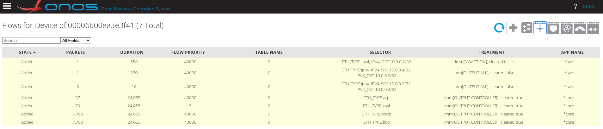

* Then ping from blue to red and from green to red:
    ```
    haibipeng@ubuntu:~/Downloads/SDN_demos/Demo6/Demo6_solutions_Haibi_Peng_875552/scripts$ sudo ip netns exec green ping -c 1 10.0.0.2
    PING 10.0.0.2 (10.0.0.2) 56(84) bytes of data.
    64 bytes from 10.0.0.2: icmp_seq=1 ttl=64 time=8.00 ms

    --- 10.0.0.2 ping statistics ---
    1 packets transmitted, 1 received, 0% packet loss, time 0ms
    rtt min/avg/max/mdev = 8.000/8.000/8.000/0.000 ms
    haibipeng@ubuntu:~/Downloads/SDN_demos/Demo6/Demo6_solutions_Haibi_Peng_875552/scripts$ sudo ip netns exec blue ping -c 1 10.0.0.2
    PING 10.0.0.2 (10.0.0.2) 56(84) bytes of data.
    64 bytes from 10.0.0.2: icmp_seq=1 ttl=64 time=7.64 ms

    --- 10.0.0.2 ping statistics ---
    1 packets transmitted, 1 received, 0% packet loss, time 0ms
    rtt min/avg/max/mdev = 7.643/7.643/7.643/0.000 ms
    ```

And the ICMP traffic is allowed from both green and blue to red.

#### Task1.5

* It is not needed to delete the previously created flow rules to activate flow rule number 3 and 4.


#### Task1.6

First, in the flow rules json, the device id(connected to red) is specified. The selector criteria specify the details of the traffic, which is only the HTTP and HTTPS traffic to red. Then the treatment instructions is set to allow all selected traffic to the red.

Then, run script of task1.3 to block all traffic to red.

* command used: 
    ```bash
    $ sudo python3 task1.6.py
    ```
    ```bash
    $ sudo python3 task1.3.py
    ```
* output:
    ```
    haibipeng@ubuntu:~/Downloads/SDN_demos/Demo6/Demo6_solutions_Haibi_Peng_875552/scripts$ sudo python3 task1.6.py
    200
    haibipeng@ubuntu:~/Downloads/SDN_demos/Demo6/Demo6_solutions_Haibi_Peng_875552/scripts$ sudo python3 task1.3.py
    200
    ```

* The Flows for Device of:00006600ea3e3f41 are as follows:
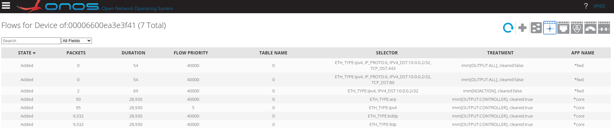

* When curl from blue to red, the HTTP and HTTPS traffic is allowed.
  
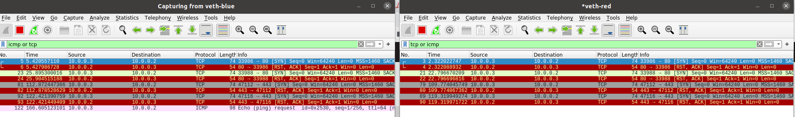

* However, ping from blue to red is blocked:
    ```
    haibipeng@ubuntu:~/Downloads/SDN_demos/Demo6/Demo6_solutions_Haibi_Peng_875552/scripts$ sudo ip netns exec blue ping -c 1 10.0.0.2
    PING 10.0.0.2 (10.0.0.2) 56(84) bytes of data.

    --- 10.0.0.2 ping statistics ---
    1 packets transmitted, 0 received, 100% packet loss, time 0ms
    ```

As we can see the ICMP traffic is blocked from blue to red.

### Task2

#### Task2.1

* command used: 
    ```bash
    $ sudo python3 task2.1.py
    ```
* output:
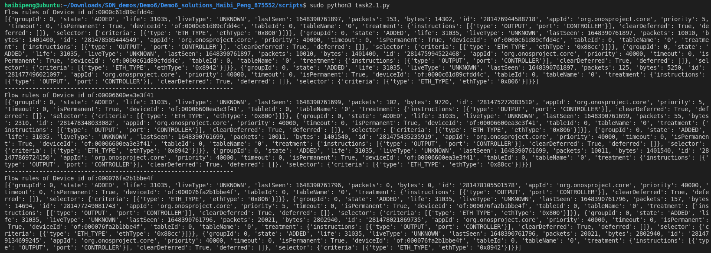

#### Task2.2

* command used: 
    ```bash
    $ sudo python3 task2.2.py
    ```
* output:
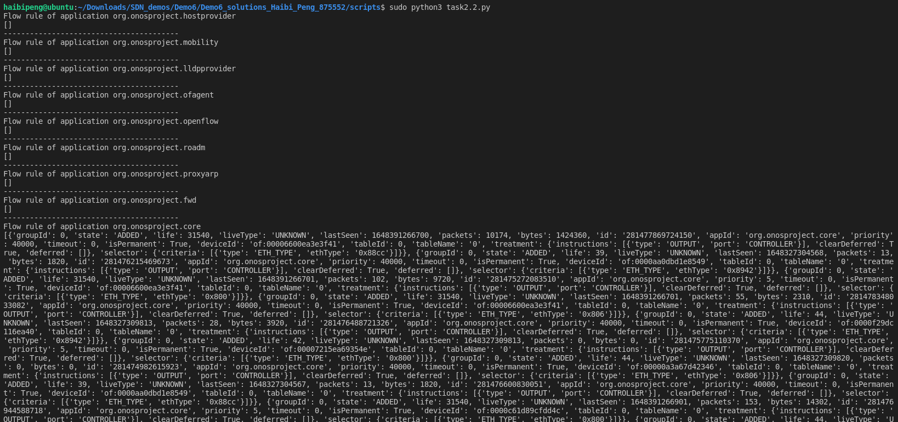


#### Task2.3

* command used: 
    ```bash
    $ sudo python3 task2.3.py
    ```
* output:
    ```
    haibipeng@ubuntu:~/Downloads/SDN_demos/Demo6/Demo6_solutions_Haibi_Peng_875552/scripts$ sudo python3 task2.3.py
    <Response [204]>
    ```

Before delete:
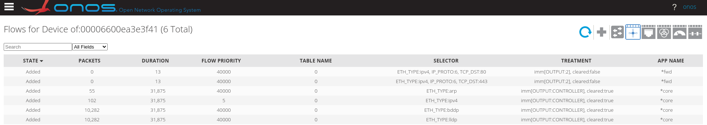

After delete:
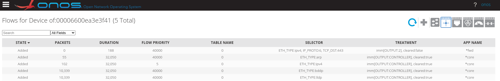
