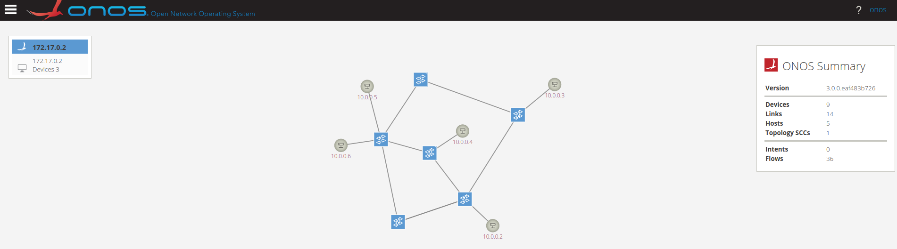

# Solutions to tasks of Demo7

## Demo7

##### **Note**: I used python scripts to finish the tasks. The python scripts can be found in /scripts folder. Each execution of python script is under this path.

### Pre Task

Use the python code created in the previous demonstration to access ONOS RESTful API interface and activate the required ONOS applications.

* command used: 
    ```bash
    $ sudo python3 pre-task.py
    ```
* output:
    ```
    haibipeng@ubuntu:~/Downloads/SDN_demos/Demo7/Demo7_solutions_Haibi_Peng_875552/scripts$ sudo python3 pre-task.py
    Activated : org.onosproject.hostprovider 
    Activated : org.onosproject.mobility 
    Activated : org.onosproject.lldpprovider 
    Activated : org.onosproject.ofagent 
    Activated : org.onosproject.openflow
    Activated : org.onosproject.roadm 
    Activated : org.onosproject.proxyarp 
    Activated : org.onosproject.fwd
    ```

### Task 1

* Before using Python APIs, the topology needs to be created by running
    ```bash
    $ sudo bash demo7.sh
    ```

* topology:
    

#### Task1.1

In the flow rules json, the device id(connected to blue and green) is specified. The selector criteria specify the details of the traffic, which from red to blue. Then the treatment instructions specify that the selected traffic is forwarded to green, except for to blue.

* command used: 
    ```bash
    $ sudo python3 task1.1.py
    ```
* output:
    ```
    haibipeng@ubuntu:~/Downloads/SDN_demos/Demo7/Demo7_solutions_Haibi_Peng_875552/scripts$ sudo python3 task1.1.py
    201
    201
    ```

* The intents are as follows:


* Then ping from RED to BLACK and from BLACK to RED:
    ```
    haibipeng@ubuntu:~/Downloads/SDN_demos/Demo7/Demo7_solutions_Haibi_Peng_875552/scripts$ sudo ip netns exec black ping -c 1 10.0.0.2
    PING 10.0.0.2 (10.0.0.2) 56(84) bytes of data.
    64 bytes from 10.0.0.2: icmp_seq=1 ttl=64 time=0.795 ms

    --- 10.0.0.2 ping statistics ---
    1 packets transmitted, 1 received, 0% packet loss, time 0ms
    rtt min/avg/max/mdev = 0.795/0.795/0.795/0.000 ms
    haibipeng@ubuntu:~/Downloads/SDN_demos/Demo7/Demo7_solutions_Haibi_Peng_875552/scripts$ sudo ip netns exec red ping -c 1 10.0.0.5
    PING 10.0.0.5 (10.0.0.5) 56(84) bytes of data.
    64 bytes from 10.0.0.5: icmp_seq=1 ttl=64 time=0.071 ms

    --- 10.0.0.5 ping statistics ---
    1 packets transmitted, 1 received, 0% packet loss, time 0ms
    rtt min/avg/max/mdev = 0.071/0.071/0.071/0.000 ms
    ```

* Ping requests in wireshark:


#### Task1.2

First, I get all the intents by using GET /intents API. Second, I delete the intents one by one by using DELETE /intents/{appId}/{key} API.

* command used: 
    ```bash
    $ sudo python3 task1.2.py
    ```
* output:
    ```
    haibipeng@ubuntu:~/Downloads/SDN_demos/Demo7/Demo7_solutions_Haibi_Peng_875552/scripts$ sudo python3 task1.2.py
    [{'type': 'PointToPointIntent', 'id': '0x7', 'key': '0x7', 'appId': 'org.onosproject.fwd', 'resources': [], 'state': 'INSTALLED'}, {'type': 'PointToPointIntent', 'id': '0x6', 'key': '0x6', 'appId': 'org.onosproject.fwd', 'resources': [], 'state': 'INSTALLED'}]
    204
    204
    ```

#### Task1.3

In the flow rules json, the device id(connected to red) is specified. The selector criteria specify the details of the traffic, which all traffic to red. Then the treatment instructions is left empty so that the selected packets will be droped.

* command used: 
    ```bash
    $ sudo python3 task1.3.py
    ```
* output:
    ```
    haibipeng@ubuntu:~/Downloads/SDN_demos/Demo7/Demo7_solutions_Haibi_Peng_875552/scripts$ sudo python3 task1.3.py
    201
    ```

* The intent is created:


* Then ping from red to black and from black to red:
    ```
    haibipeng@ubuntu:~/Downloads/SDN_demos/Demo7/Demo7_solutions_Haibi_Peng_875552/scripts$ sudo ip netns exec red ping -c 1 10.0.0.5
    PING 10.0.0.5 (10.0.0.5) 56(84) bytes of data.
    64 bytes from 10.0.0.5: icmp_seq=1 ttl=64 time=0.756 ms

    --- 10.0.0.5 ping statistics ---
    1 packets transmitted, 1 received, 0% packet loss, time 0ms
    rtt min/avg/max/mdev = 0.756/0.756/0.756/0.000 ms
    haibipeng@ubuntu:~/Downloads/SDN_demos/Demo7/Demo7_solutions_Haibi_Peng_875552/scripts$ sudo ip netns exec black ping -c 1 10.0.0.2
    PING 10.0.0.2 (10.0.0.2) 56(84) bytes of data.
    64 bytes from 10.0.0.2: icmp_seq=1 ttl=64 time=0.067 ms

    --- 10.0.0.2 ping statistics ---
    1 packets transmitted, 1 received, 0% packet loss, time 0ms
    rtt min/avg/max/mdev = 0.067/0.067/0.067/0.000 ms
    ```

* Ping requests in wireshark:


#### Task1.4

* Is the Host-to-Host Intent an abstraction of the Point-to-Point Intents? Your answer must be provided with explanations.
* No. I think the Host-to-Host Intent is not an abstraction of the Point-to-Point Intents. Because Point-to-Point is at the switch level(specify the device ids) and Host-to-Host(specify the namespace mac addresses) is at the namespace level. 
* As the [document1](https://javadoc.io/static/org.onosproject/onos-api/1.10.11/org/onosproject/net/intent/HostToHostIntent.html) states, ***HostToHostIntent*** is the ***Abstraction of end-station to end-station bidirectional connectivity***, where ***end-station to end-station*** does not equal Point-to-Point. Bisides, [document2](http://api.onosproject.org/1.5.1/org/onosproject/net/intent/PointToPointIntent.html) states that ***PointToPointIntent*** is the ***Abstraction of point-to-point connectivity***.


#### Task1.5

* What path is selected by the Host-to-Host Intent for enabling the communication between the “RED" network namespace and the “BLACK" network namespace?

First, let's see the flows of device of:00009ed62bc8b14b(connected to RED) and of:00000a8618536343(connected to BLACK):


As we can see, for device of:00009ed62bc8b14b(connected to RED), the IN_PORT/OUTPUT port pair is 4 and 3. Since port 4 is the interface connected to RED, then port 3 is connected to ***device of:000096b38f961446***.
For of:00000a8618536343(connected to BLACK), the IN_PORT/OUTPUT port pair is 4 and 1. Since port 4 is the interface connected to BLACK, and port 1 is connected also to ***device of:000096b38f961446***.
Therefore, the path is as follows:
***RED ==> of:00009ed62bc8b14b/3-of:000096b38f961446/3 ==> of:000096b38f961446/1-of:00000a8618536343/1 ==> BLACK***

#### Task1.6

* After specifying the path, you are asked to provide a hypothesis on how the Host-to-Host Intent selects paths.
* After the Host-to-Host Intent is created, the optical path provisioner calculates optical path between given two hosts, which should be one of the shortest paths between them, and sets up the connectivity
along the calculated path.


#### Task1.7

* command used: 
    ```bash
    $ sudo python3 task1.7.py
    ```
* output:
    ```
    haibipeng@ubuntu:~/Downloads/SDN_demos/Demo7/Demo7_solutions_Haibi_Peng_875552/scripts$ sudo python3 task1.7.py
    Intent between 06:F9:EA:86:BE:EB and 5A:B6:94:09:64:25: 201
    Intent between 06:F9:EA:86:BE:EB and D6:B3:89:DF:3F:32: 201
    Intent between 06:F9:EA:86:BE:EB and 4E:34:A5:A4:EA:D3: 201
    Intent between 06:F9:EA:86:BE:EB and 06:37:D5:AE:25:BB: 201
    Intent between 5A:B6:94:09:64:25 and D6:B3:89:DF:3F:32: 201
    Intent between 5A:B6:94:09:64:25 and 4E:34:A5:A4:EA:D3: 201
    Intent between 5A:B6:94:09:64:25 and 06:37:D5:AE:25:BB: 201
    Intent between D6:B3:89:DF:3F:32 and 4E:34:A5:A4:EA:D3: 201
    Intent between D6:B3:89:DF:3F:32 and 06:37:D5:AE:25:BB: 201
    Intent between 4E:34:A5:A4:EA:D3 and 06:37:D5:AE:25:BB: 201
    ```
* output:


#### Task1.8

* The intent used:
    ```json
    {
    "type": "SinglePointToMultiPointIntent",
    "appId": "org.onosproject.fwd",
    "priority": 55,
    "selector": {
        "criteria": [
            {
                "type":"ETH_TYPE",
                "ethType":"0x0800"
            },
            {
                "type": "TCP_DST",
                "tcpPort": 4009
            },
            {
                "type": "IP_PROTO",
                "protocol": 6
            }
        ]
    },
    "ingressPoint": {
        "port": "4",
        "device": "of:00009ed62bc8b14b"
    },
    "egressPoint": [
        {
            "port": "3",
            "device": "of:0000527da71fda4f"
        },
        {
            "port": "2",
            "device": "of:000096b38f961446"
        },
        {
            "port": "4",
            "device": "of:00000a8618536343"
        }
    ]
    }
    ```

* command used: 
    ```bash
    $ sudo python3 task1.8.py
    ```
* output:


* running verification commands:
    ```
    haibipeng@ubuntu:~/Downloads/SDN_demos/Demo7/Demo7_solutions_Haibi_Peng_875552/scripts$ sudo ip netns exec red nc 10.0.0.5 4009
    haibipeng@ubuntu:~/Downloads/SDN_demos/Demo7/Demo7_solutions_Haibi_Peng_875552/scripts$ sudo ip netns exec red nc 10.0.0.5 80
    ```

* wireshark output:


However, the restriction on the TCP port 4009 did not work.

#### Task1.9

* Explain the benefits brought by the use of Intent-based networking compared to Open-Flow flow rules.
* The Intent-based networkinghow can better abstract network architecture and it is like a collection of multiple flow rules. An intent can create multiple flow rules at a time and there is no need to set flow rules at each devices one by one.


## Reference
[1] [SDN using ONOS Controller](https://www.politesi.polimi.it/bitstream/10589/126681/7/SDN%20using%20ONOS%20Controller.pdf)