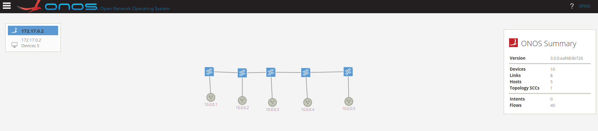
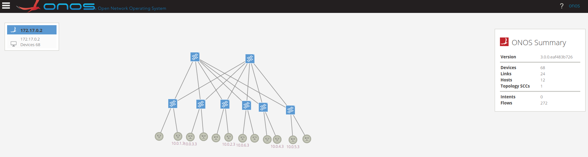
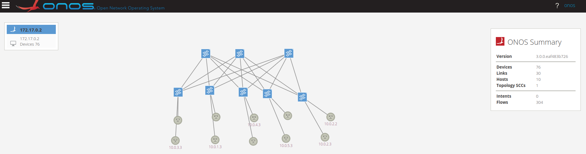

# Solutions to tasks of Demo2 and 3

## Demo2

##### **Note**: I used shell scripts to finish the tasks. The shell scripts can be found in /scripts folder. Each execution of shell script is under this path.
* Before I executed each python scripts, I ran
    ```bash
    $ sudo bash clean-ns.sh
    ```
    to clean and exit previous namespaces, bridges and links.

### Task 1.1

##### A linear topology of 5 switches and 5 hosts.

* command used: 
    ```bash
    $ sudo bash 1.1linear.sh
    ```
* output:
    ```
    Creating the namespace ns-1
    Creating the namespace ns-2
    Creating the namespace ns-3
    Creating the namespace ns-4
    Creating the namespace ns-5
    Creating the OVS bridge br-1
    Creating the OVS bridge br-2
    Creating the OVS bridge br-3
    Creating the OVS bridge br-4
    Creating the OVS bridge br-5
    Attaching the OVS br-1 to the OVS br-2
    Attaching the OVS br-2 to the OVS br-3
    Attaching the OVS br-3 to the OVS br-4
    Attaching the OVS br-4 to the OVS br-5
    Attaching the namespace ns-1 to the OVS br-1
    Attaching the namespace ns-2 to the OVS br-2
    Attaching the namespace ns-3 to the OVS br-3
    Attaching the namespace ns-4 to the OVS br-4
    Attaching the namespace ns-5 to the OVS br-5
    Attaching the OVS bridge to the ONOS controller
    Attaching the OVS bridge to the ONOS controller
    Attaching the OVS bridge to the ONOS controller
    Attaching the OVS bridge to the ONOS controller
    Attaching the OVS bridge to the ONOS controller
    PING 10.0.0.2 (10.0.0.2) 56(84) bytes of data.
    64 bytes from 10.0.0.2: icmp_seq=1 ttl=64 time=0.808 ms

    --- 10.0.0.2 ping statistics ---
    1 packets transmitted, 1 received, 0% packet loss, time 0ms
    rtt min/avg/max/mdev = 0.808/0.808/0.808/0.000 ms
    PING 10.0.0.3 (10.0.0.3) 56(84) bytes of data.
    64 bytes from 10.0.0.3: icmp_seq=1 ttl=64 time=0.709 ms

    --- 10.0.0.3 ping statistics ---
    1 packets transmitted, 1 received, 0% packet loss, time 0ms
    rtt min/avg/max/mdev = 0.709/0.709/0.709/0.000 ms
    PING 10.0.0.4 (10.0.0.4) 56(84) bytes of data.
    64 bytes from 10.0.0.4: icmp_seq=1 ttl=64 time=0.334 ms

    --- 10.0.0.4 ping statistics ---
    1 packets transmitted, 1 received, 0% packet loss, time 0ms
    rtt min/avg/max/mdev = 0.334/0.334/0.334/0.000 ms
    PING 10.0.0.5 (10.0.0.5) 56(84) bytes of data.
    64 bytes from 10.0.0.5: icmp_seq=1 ttl=64 time=0.265 ms

    --- 10.0.0.5 ping statistics ---
    1 packets transmitted, 1 received, 0% packet loss, time 0ms
    rtt min/avg/max/mdev = 0.265/0.265/0.265/0.000 ms
    PING 10.0.0.2 (10.0.0.2) 56(84) bytes of data.
    64 bytes from 10.0.0.2: icmp_seq=1 ttl=64 time=0.435 ms

    --- 10.0.0.2 ping statistics ---
    1 packets transmitted, 1 received, 0% packet loss, time 0ms
    rtt min/avg/max/mdev = 0.435/0.435/0.435/0.000 ms
    ```
    * graph:
    
### Task 1.2
  
* command used: 
    ```bash
    $ sudo python 1.2tree.sh
    ```
* output:
    ```
    Creating the OVS bridge br-1
    Attaching the OVS bridge to the ONOS controller
    Creating the OVS bridge br-2
    Attaching the OVS bridge to the ONOS controller
    Creating the OVS bridge br-3
    Attaching the OVS bridge to the ONOS controller
    Creating the OVS bridge br-4
    Attaching the OVS bridge to the ONOS controller
    Creating the OVS bridge br-5
    Attaching the OVS bridge to the ONOS controller
    Creating the OVS bridge br-6
    Attaching the OVS bridge to the ONOS controller
    Creating the OVS bridge br-7
    Creating the namespace ns-1
    Attaching the namespace ns-1 to the OVS br-4
    Creating the namespace ns-2
    Attaching the namespace ns-2 to the OVS br-4
    Creating the namespace ns-3
    Attaching the namespace ns-3 to the OVS br-5
    Creating the namespace ns-4
    Attaching the namespace ns-4 to the OVS br-5
    Creating the namespace ns-5
    Attaching the namespace ns-5 to the OVS br-6
    Creating the namespace ns-6
    Attaching the namespace ns-6 to the OVS br-6
    Creating the namespace ns-7
    Attaching the namespace ns-7 to the OVS br-7
    Creating the namespace ns-8
    Attaching the namespace ns-8 to the OVS br-7
    Attaching the OVS br-1 to the OVS br-2
    Attaching the OVS br-1 to the OVS br-3
    Attaching the OVS br-2 to the OVS br-4
    Attaching the OVS br-2 to the OVS br-5
    Attaching the OVS br-3 to the OVS br-6
    Attaching the OVS br-3 to the OVS br-7
    PING 10.0.0.2 (10.0.0.2) 56(84) bytes of data.
    64 bytes from 10.0.0.2: icmp_seq=1 ttl=64 time=187 ms

    --- 10.0.0.2 ping statistics ---
    1 packets transmitted, 1 received, 0% packet loss, time 0ms
    rtt min/avg/max/mdev = 187.436/187.436/187.436/0.000 ms
    PING 10.0.0.3 (10.0.0.3) 56(84) bytes of data.
    64 bytes from 10.0.0.3: icmp_seq=1 ttl=64 time=1060 ms

    --- 10.0.0.3 ping statistics ---
    1 packets transmitted, 1 received, 0% packet loss, time 0ms
    rtt min/avg/max/mdev = 1059.947/1059.947/1059.947/0.000 ms
    PING 10.0.0.4 (10.0.0.4) 56(84) bytes of data.
    64 bytes from 10.0.0.4: icmp_seq=1 ttl=64 time=33.6 ms

    --- 10.0.0.4 ping statistics ---
    1 packets transmitted, 1 received, 0% packet loss, time 0ms
    rtt min/avg/max/mdev = 33.647/33.647/33.647/0.000 ms
    PING 10.0.0.5 (10.0.0.5) 56(84) bytes of data.
    64 bytes from 10.0.0.5: icmp_seq=1 ttl=64 time=59.0 ms

    --- 10.0.0.5 ping statistics ---
    1 packets transmitted, 1 received, 0% packet loss, time 0ms
    rtt min/avg/max/mdev = 58.995/58.995/58.995/0.000 ms
    PING 10.0.0.6 (10.0.0.6) 56(84) bytes of data.
    64 bytes from 10.0.0.6: icmp_seq=1 ttl=64 time=46.2 ms

    --- 10.0.0.6 ping statistics ---
    1 packets transmitted, 1 received, 0% packet loss, time 0ms
    rtt min/avg/max/mdev = 46.196/46.196/46.196/0.000 ms
    PING 10.0.0.7 (10.0.0.7) 56(84) bytes of data.
    64 bytes from 10.0.0.7: icmp_seq=1 ttl=64 time=82.5 ms

    --- 10.0.0.7 ping statistics ---
    1 packets transmitted, 1 received, 0% packet loss, time 0ms
    rtt min/avg/max/mdev = 82.459/82.459/82.459/0.000 ms
    PING 10.0.0.8 (10.0.0.8) 56(84) bytes of data.
    64 bytes from 10.0.0.8: icmp_seq=1 ttl=64 time=34.0 ms

    --- 10.0.0.8 ping statistics ---
    1 packets transmitted, 1 received, 0% packet loss, time 0ms
    rtt min/avg/max/mdev = 34.009/34.009/34.009/0.000 ms
    PING 10.0.0.1 (10.0.0.1) 56(84) bytes of data.
    64 bytes from 10.0.0.1: icmp_seq=1 ttl=64 time=51.1 ms

    --- 10.0.0.1 ping statistics ---
    1 packets transmitted, 1 received, 0% packet loss, time 0ms
    rtt min/avg/max/mdev = 51.091/51.091/51.091/0.000 ms
    ```
    * graph:
    
* **Note**: In the script of linear topology, I referenced the source code of the TreeTopo from the Mininet GitHub repository and add switch protocols as 'OpenFlow13' in the code.

### Task 1.3

* For Task 3, I put previous shell scripts together to form [1.3automate.sh](scripts/1.3automate.sh) and add a functionality, which is to read arguments from cmd input to see what kind of topology is required to be implemented and its related parameters. The usage is as follows.

##### 0. Base command
The base command is:
   ```bash
   sudo bash 1.3automate.sh topoType arg1 arg2
   ```

##### 1. Linear topology
If the topology is 'linear', which means linear topology, then arg1 represents the number of switches and arg2 represents the number of hosts.
* Example command: 
    ```bash
    $ sudo bash 1.3automate.sh linear 5 5
    ```
    It creates a linear topology of 5 switches and 5 hosts.

##### 2. Tree topology
If the topology is 'tree', which means tree topology, then arg1 represents the depths of the tree and arg2 represents the value of fanout.
* Example command: 
    ```bash
    $ sudo bash 1.3automate.sh tree 3 2
    ```
    It creates a tree topology with the depth of 3 and fanout of 2.

##### The outputs are similar to those in Task 1.1 and 1.2, so it is not necessary to put them here again.


## Demo3

##### **Note**: I used python scripts to finish the tasks. The python scripts can be found in /scripts folder. Each execution of python script is under this path.
* Before I executed each python scripts, I ran
    ```bash
    $ sudo bash clean-lxc.sh
    ```
    to clean and exit previous containers, bridges and links.

### Task 2.1

##### A leaf and spine topology of 2 spine switches and 5 hosts.

* command used: 
    ```bash
    $ sudo python3 2.1leafandspine.py
    ```

* output:
    ```
    $ sudo python3 2.1leafandspine.py
    Creating the OVS bridge ovs-1
    Attaching the OVS bridge to the ONOS controller
    Creating the OVS bridge ovs-2
    Attaching the OVS bridge to the ONOS controller
    Creating the OVS bridge ovs-3
    Attaching the OVS bridge to the ONOS controller
    Creating the OVS bridge ovs-4
    Attaching the OVS bridge to the ONOS controller
    Creating the OVS bridge ovs-5
    Attaching the OVS bridge to the ONOS controller
    Creating the OVS bridge ovs-6
    Attaching the OVS bridge to the ONOS controller
    Creating the OVS bridge ovs-7
    Attaching the OVS bridge to the ONOS controller
    Creating the OVS bridge ovs-8
    Attaching the OVS bridge to the ONOS controller
    Attaching the OVS ovs-1 to the OVS ovs-3
    Attaching the OVS ovs-1 to the OVS ovs-4
    Attaching the OVS ovs-1 to the OVS ovs-5
    Attaching the OVS ovs-1 to the OVS ovs-6
    Attaching the OVS ovs-1 to the OVS ovs-7
    Attaching the OVS ovs-1 to the OVS ovs-8
    Attaching the OVS ovs-2 to the OVS ovs-3
    Attaching the OVS ovs-2 to the OVS ovs-4
    Attaching the OVS ovs-2 to the OVS ovs-5
    Attaching the OVS ovs-2 to the OVS ovs-6
    Attaching the OVS ovs-2 to the OVS ovs-7
    Attaching the OVS ovs-2 to the OVS ovs-8
    Creating the container: lxc-1-1
    RUNNING
    ......
    ```

* graph:


### Task 2.2

##### Automation of Task 2.1

* The logic here is to collect parameters from terminal input(ask you to input related parameters), and then the python scripts will create the topology based on the input.

* command used: 
    ```bash
    $ sudo python3 2.2automate.py
    ```

* output:
    ```
    $ sudo python3 2.2automate.py
    Enter the spine number: 3
    Enter the leaf number: 5
    Enter the host node number for each leaf switch: 2
    Creating the OVS bridge ovs-1
    Attaching the OVS bridge to the ONOS controller
    Creating the OVS bridge ovs-2
    Attaching the OVS bridge to the ONOS controller
    Creating the OVS bridge ovs-3
    Attaching the OVS bridge to the ONOS controller
    Creating the OVS bridge ovs-4
    Attaching the OVS bridge to the ONOS controller
    Creating the OVS bridge ovs-5
    Attaching the OVS bridge to the ONOS controller
    Creating the OVS bridge ovs-6
    Attaching the OVS bridge to the ONOS controller
    Creating the OVS bridge ovs-7
    Attaching the OVS bridge to the ONOS controller
    Creating the OVS bridge ovs-8
    Attaching the OVS bridge to the ONOS controller
    Attaching the OVS ovs-1 to the OVS ovs-4
    Attaching the OVS ovs-1 to the OVS ovs-5
    Attaching the OVS ovs-1 to the OVS ovs-6
    Attaching the OVS ovs-1 to the OVS ovs-7
    Attaching the OVS ovs-1 to the OVS ovs-8
    Attaching the OVS ovs-2 to the OVS ovs-4
    Attaching the OVS ovs-2 to the OVS ovs-5
    Attaching the OVS ovs-2 to the OVS ovs-6
    Attaching the OVS ovs-2 to the OVS ovs-7
    Attaching the OVS ovs-2 to the OVS ovs-8
    Attaching the OVS ovs-3 to the OVS ovs-4
    Attaching the OVS ovs-3 to the OVS ovs-5
    Attaching the OVS ovs-3 to the OVS ovs-6
    Attaching the OVS ovs-3 to the OVS ovs-7
    Attaching the OVS ovs-3 to the OVS ovs-8
    Creating the container: lxc-1-1
    RUNNING
    ......
    ```

* graph:



### Task 2.3

* Compared to namespaces (Demo 2), I find manipulating low-level containers a bit harder to implement and understand. Because you need more APIs(with Python) and more parameters(with shell commands, like in here: [LXC](https://ubuntu.com/server/docs/containers-lxc)). And also there are more steps to use LXC, for example you need to first create a LXC and then you need to start it. You will also have to attach the commands to the LXC that you would like to execute on.
